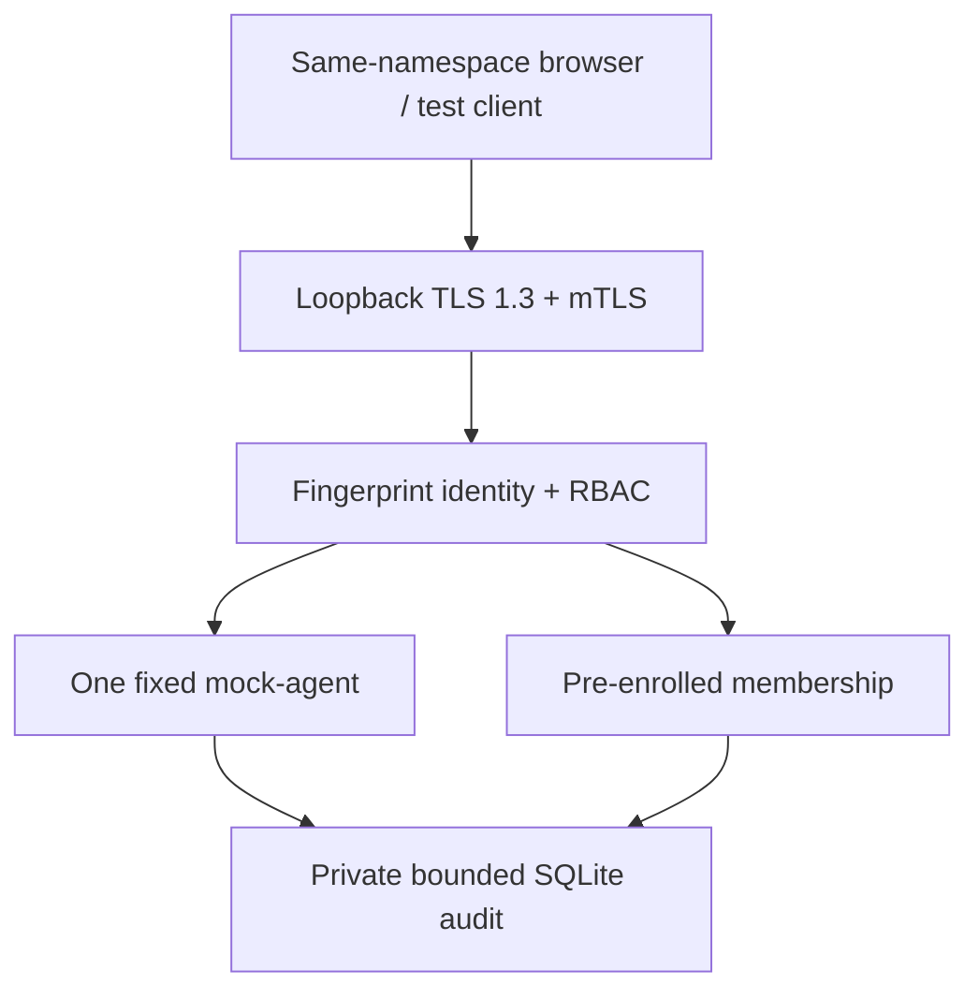

# Architecture

## Implemented educational MVP

`mocklab/core.py`: strict envelope, roles, replay, lifecycle, management and
fail-closed audit. `storage.py`: private SQLite FULL sync, capacity and recovery.
`identity.py`: offline ephemeral token identities; HTTP instead uses mTLS pinning.
`server.py`: single-threaded loopback API and fixed UI routes; `web/`: no CDN/assets
or credential storage. `containment.py`: runtime startup/request guard.

All network components share one network-none container or verified isolated
namespace. No public ports, cross-container bridge or host networking. Build and
PKI provisioning occur before listener startup; runtime is read-only and network-none.

One agent is intentional. Fixed synthetic event is not a host event. Stop changes
only mock state. Roles/expiry/revocation are enforced server-side, never just UI.
Before effects an allowed event is committed; completed event follows. Interrupted
allowed without completed blocks recovery. Completed stop and membership changes
are restored. Accepted request IDs survive with the journal. No automatic unsafe retry.

The journal is bounded and append-only at the application interface, not tamper-proof
against the OS owner. Tmpfs acceptance is disposable; offline persistent storage is
explicit. No cloud DB, arbitrary agent plugins, external targets or credentials.

Contracts: [CORE-CONTRACT.md](CORE-CONTRACT.md), [API.md](API.md).
Acceptance and remaining operational limits: [VALIDATION.md](VALIDATION.md).
