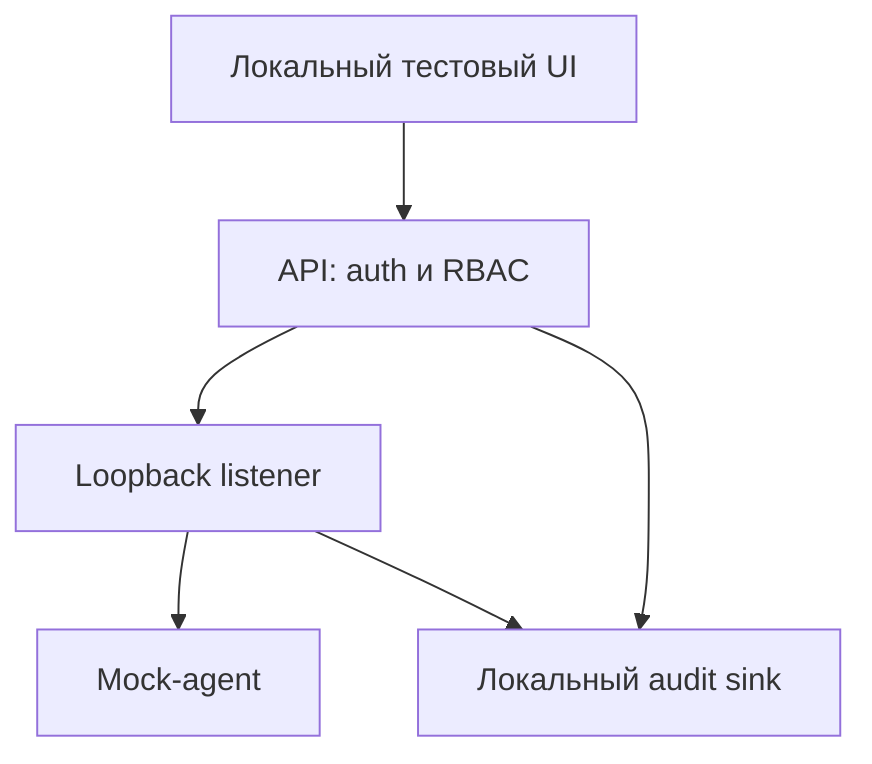

# Architecture

## Статус и границы

Это проектная архитектура учебного MVP. Runtime-компоненты не реализованы.
Лаборатория работает с mock-агентами, фиксированными операциями и synthetic
fixtures. Реальных targets и интеграций с production нет.

## Компоненты

Диаграмма показывает логические связи, а не готовый deployment. Для первого
сетевого прототипа все компоненты размещаются в одной отдельной VM или одном
network namespace: так listener и mock-agent могут использовать `127.0.0.1`.
При последующем разделении на контейнеры loopback одного контейнера недоступен
другому; отдельный внутренний transport требует новой модели угроз и тестов.
Host networking не используется как обход этого ограничения.

| Компонент | Ответственность | Ограничение |
| --- | --- | --- |
| UI | Состояние сценария, запрос тестовой операции, просмотр аудита | Доступ только через API; не хранит секреты в браузерном storage |
| API | Проверка identity, lab scope, роли и структуры запроса | Default deny, лимиты запросов и payload |
| Listener | Передача разрешённого сообщения mock-agent | Только loopback; нет публичного listener |
| Mock-agent | Детерминированный ответ из synthetic fixtures | Нет shell, subprocess, чтения файлов хоста или динамической загрузки кода |
| Audit sink | Запись результатов авторизации и lifecycle | Секреты и произвольный payload не записываются |

## Контракт операций

Операции задаются перечислением; расширяемый arbitrary command string запрещён.

| Операция | Результат | Побочный эффект |
| --- | --- | --- |
| `ping` | Фиксированный тестовый `pong` | Запись события аудита |
| `status` | Синтетический lifecycle state | Запись события аудита |
| `emit_test_event` | Событие из заранее заданного fixture ID | Ограниченная запись в audit sink |
| `stop` | Переход mock-agent в `stopped` | Завершение только тестового lifecycle |

Первый MVP не принимает пользовательский код, пути к файлам, URL или shell
аргументы. Неизвестная операция и неизвестный fixture ID отклоняются.

Планируемый envelope: `schema_version`, `request_id`, `lab_id`, `agent_id`,
`operation`, `fixture_id` (только для `emit_test_event`). API назначает identity
по проверенной аутентификации; присланные клиентом `actor_id` и `role` не доверены.
ID имеют ограниченную длину и формат. Срок действия, защита от повторов и
границы хранения request ID должны определяться контрактом перед реализацией.

## RBAC

| Действие | Viewer | Operator | Lab admin |
| --- | --- | --- | --- |
| Читать состояние и обезличенный аудит своей лаборатории | Да | Да | Да |
| Выполнять фиксированные mock-операции | Нет | Да | Да |
| Менять membership и роли своей лаборатории | Нет | Нет | Да |
| Отключать containment, аудит или расширять операции произвольным кодом | Нет | Нет | Нет |

Роль не даёт доступа к другой лаборатории. Проверка выполняется на каждом
запросе на сервере, а не только в UI. Тестовые identities создаются вне Git;
shared credentials и default passwords не допускаются. RBAC, transport identity
и mTLS остаются отдельными контролями; сертификат не заменяет авторизацию.

## Аудит и обработка отказов

Планируемое audit event: `schema_version`, `event_id`, `timestamp_utc`,
`request_id`, `lab_id`, `actor_id`, `agent_id`, `operation`, `outcome`,
`reason_code`. Время и identity формирует сервер. Outcome — `allowed`, `denied`,
`completed` или `failed`; пары событий связываются request ID.

Сначала сохраняется разрешение/отказ, затем выполняется операция, после чего
фиксируется результат. При недоступном обязательном audit sink операция не
начинается. Если финальная запись не удалась, API сообщает ошибку, блокирует
следующие изменяющие действия и требует разбора состояния; успех не утверждается.
Автоматическое повторение операций без определённой идемпотентности запрещено.

Журнал не содержит токенов, ключей, сырых запросов или данных хоста. Строки
кодируются структурированно, размер событий и журналов ограничен. Локальный
append-only режим не гарантирует защиту от администратора ОС; экспорт,
контроль целостности и retention требуют отдельной реализации.

## Containment и lifecycle

1. Проверить синтаксис конфигурации и допустимые операции.
2. Подтвердить аутентификацию, RBAC, loopback bind и доступность audit sink.
3. Проверить изоляцию на уровне VM/контейнерной сети; при отсутствии подтверждения
   не запускать сценарий.
4. Создать mock-agent из фиксированного fixture, ограничить число событий.
5. Завершить сценарий через `stop`, закрыть listener и очистить тестовые identities.

Egress deny обеспечивается внешней политикой среды; приложение не может
самостоятельно доказать отсутствие маршрутов. Проверки сети используют только
контролируемые тестовые endpoints и не обращаются к третьим сторонам.
